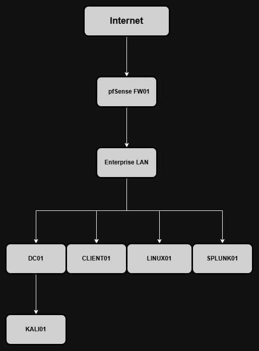

# Enterprise Home Lab

## Overview

This repository documents the development of an enterprise-style home lab designed to simulate a real corporate IT infrastructure.

The goal is to gain hands-on experience with Windows Server, Active Directory, Linux, networking and cybersecurity while documenting every step of the learning process.

---

<h2 align="center">Lab Architecture</h2>

  
   
  <em>Figure 1 - Enterprise Home Lab Network Topology</em>

---

## Project Status

Last updated: October 2, 2026

| Phase | Status |
|---|---|
| Project Planning | ✅ Completed |
| Architecture Design | ✅ Completed |
| VirtualBox Environment | ✅ Completed |
| Windows Server 2022 Deployment | ✅ Completed |
| Static Network Configuration | ✅ Completed |
| Active Directory Domain Services | ✅ Completed |
| DNS Configuration and Validation | ✅ Completed |
| Organizational Unit Structure | ✅ Completed |
| Users and Security Groups | ✅ Completed |
| Administrative Account Separation | ✅ Completed |
| pfSense Firewall | ✅ Completed |
| DHCP Server | ⏳ Planned |
| Windows 11 Domain Client | ✅ Completed |
| Group Policy | ✅ First policy completed |
| File Server | ⏳ Planned |
| SIEM and Monitoring | ⏳ Planned |

---

## Latest Milestone

The first Windows 11 workstation was integrated with Active Directory,
and a user-based Group Policy was deployed and validated.

Current environment:

- Domain: corp.juniorlab.test
- NetBIOS name: CORP
- Domain Controller: DC01
- DC01 address: 192.168.10.10/24
- DNS server: DC01
- Firewall and gateway: FW01 (pfSense) at 192.168.10.1/24
- Domain workstation: CLIENT01 at 192.168.10.20/24
- Network: VirtualBox Internal Network (LAB-LAN)
- Active Directory DNS and service tests completed successfully
- Departmental OUs, users and security groups created
- Separate standard and privileged administrator accounts implemented
- CLIENT01 joined to the domain and moved to the Workstations OU
- Standard domain user authentication validated through DC01
- IT user policy created to restrict Control Panel and Windows Settings

---

## Technologies

- Windows Server 2022
- Windows 11
- Active Directory
- DNS
- DHCP
- Group Policy
- Ubuntu Server
- Docker
- pfSense
- Kali Linux
- Splunk

---

## Learning Goals

This project aims to improve my practical skills in:

- Windows Server Administration
- Active Directory
- Network Services
- Linux Administration
- Cybersecurity
- Infrastructure Documentation

---

## Documentation

- [Project Planning](docs/01-planning.md)
- [Project Roadmap](docs/01-road-map.md)
- [VirtualBox Installation](docs/02-virtualbox-installation.md)
- [Windows Server Installation](docs/03-windows-server-installation.md)
- [Network Configuration](docs/04-network-configuration.md)
- [Active Directory Deployment](docs/05-active-directory.md)
- [DNS Configuration](docs/06-dns.md)
- [pfSense Deployment](docs/07-pfsense-deployment.md)
- [Windows 11 Domain Client](docs/08-windows-11-domain-client.md)
- [Group Policy Deployment](docs/09-group-policy.md)

---

Project started in July 2026.
