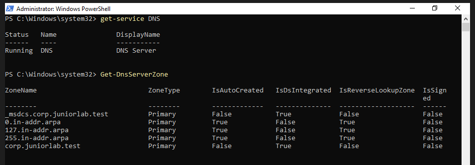
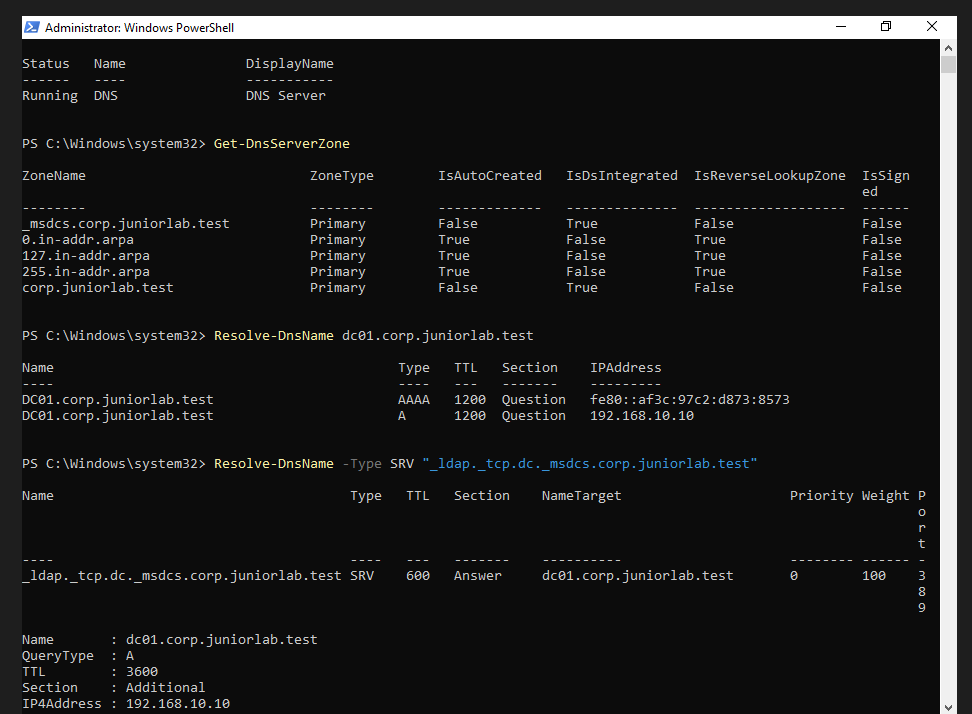
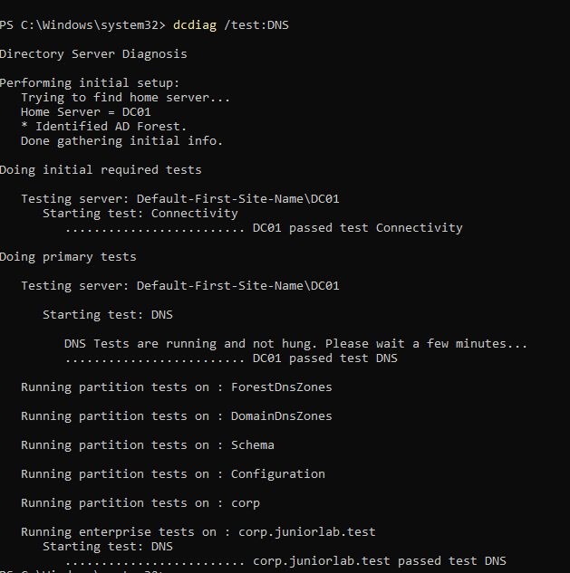

# DNS Configuration and Validation

## Overview

This document describes the DNS configuration used by the Active
Directory environment.

DNS was installed automatically with Active Directory Domain Services
when DC01 was promoted to the first domain controller of the
`corp.juniorlab.test` forest.

---

## Why Active Directory Requires DNS

Active Directory uses DNS to locate domain services.

Domain clients use DNS records to find:

- Domain controllers
- LDAP services
- Kerberos authentication
- Global Catalog servers
- Domain and forest services

For this reason, domain members must use the Active Directory DNS
server instead of a public DNS server.

---

## DNS Configuration

| Setting | Value |
|---|---|
| DNS server | DC01 |
| DNS server address | 192.168.10.10 |
| Domain zone | corp.juniorlab.test |
| Forest service zone | _msdcs.corp.juniorlab.test |
| Zone storage | Active Directory integrated |
| DNSSEC | Not configured |
| External forwarding | Planned |

DC01 uses its own static address, `192.168.10.10`, as its preferred DNS
server.

---

## DNS Service Validation

The DNS service status was checked with:

```powershell
Get-Service DNS
```

The service returned the `Running` status.



---

## Active Directory Integrated Zones

The configured DNS zones were inspected with:

```powershell
Get-DnsServerZone
```

The following principal zones were found:

| Zone | Type | AD Integrated |
|---|---|---|
| corp.juniorlab.test | Primary | Yes |
| _msdcs.corp.juniorlab.test | Primary | Yes |

The `corp.juniorlab.test` zone stores records for the domain.

The `_msdcs.corp.juniorlab.test` zone stores records used to locate
domain controllers and forest services.

The `0.in-addr.arpa`, `127.in-addr.arpa` and `255.in-addr.arpa` zones
were automatically created by Windows DNS.

---

## Host Record Validation

The DC01 host record was tested with:

```powershell
Resolve-DnsName dc01.corp.juniorlab.test
```

The query successfully returned:

```text
DC01.corp.juniorlab.test → 192.168.10.10
```

This confirms that the DNS `A` record correctly associates the server
name with its static IPv4 address.

An IPv6 link-local `AAAA` record was also registered automatically.

---

## Domain Controller Discovery

The LDAP service record was tested with:

```powershell
Resolve-DnsName -Type SRV "_ldap._tcp.dc._msdcs.corp.juniorlab.test"
```

The query returned:

| Property | Result |
|---|---|
| Target | dc01.corp.juniorlab.test |
| Port | 389 |
| Priority | 0 |
| Weight | 100 |
| IPv4 address | 192.168.10.10 |

The SRV record allows domain clients to discover the domain controller
and its LDAP service.



---

## DNS Health Validation

The Active Directory DNS diagnostic was executed with:

```powershell
dcdiag /test:DNS
```

The following tests completed successfully:

```text
DC01 passed test Connectivity
DC01 passed test DNS
corp.juniorlab.test passed test DNS
```



---

## Current State and Limitation

External DNS forwarding and internet name resolution through pfSense were
subsequently configured. DNS was also validated from the domain workstation:

- `dc01.corp.juniorlab.test` resolved to `192.168.10.10`.
- External names such as `google.com` resolved through DC01.
- CLIENT01 used `192.168.10.10` as its DNS server through DHCP.

The remaining DNS improvement is a reverse lookup zone for
`192.168.10.0/24`. Without a matching PTR record, tools such as `nslookup` can
show the DNS server name as `Unknown` even though forward resolution works.

---

## Lessons Learned

- Active Directory depends on DNS for service discovery.
- An `A` record maps a hostname to an IPv4 address.
- An `AAAA` record maps a hostname to an IPv6 address.
- An `SRV` record identifies the location and port of a service.
- AD-integrated zones are stored and replicated through Active Directory.
- A running DNS service does not guarantee that the domain records are
  correct, so direct queries and diagnostic tests are necessary.

---

## Next Steps

- Create a reverse lookup zone for the lab network.
- Add PTR records for statically addressed infrastructure systems.
- Forward DNS events and service health data to the future monitoring system.
