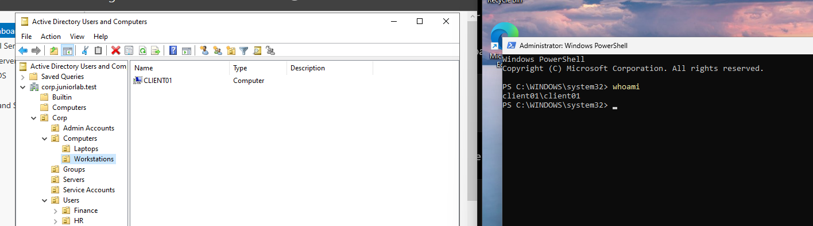
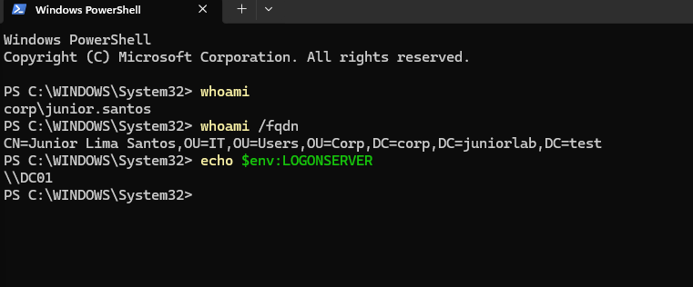
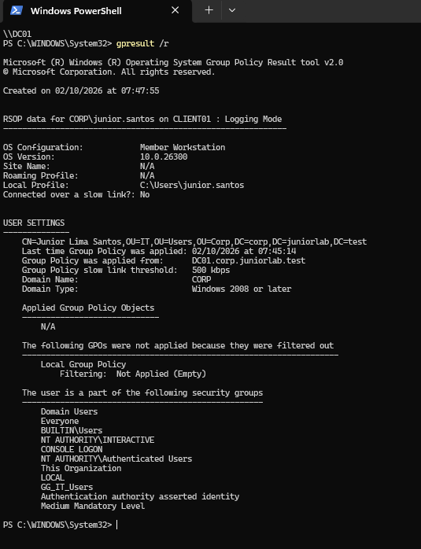

# Windows 11 Domain Client Deployment

## Overview

This document describes the deployment of `CLIENT01`, the first Windows 11
workstation in the lab. The workstation was connected to `LAB-LAN`, joined to
the Active Directory domain and validated with a standard domain user.

The objective was to reproduce a common corporate support workflow: prepare a
workstation, connect it to the domain, organize its computer account and confirm
that a user can authenticate through the domain controller.

---

## Environment

| Component | Configuration |
|---|---|
| Computer name | CLIENT01 |
| Operating system | Windows 11 Pro |
| IPv4 address | 192.168.10.20/24 |
| Default gateway | 192.168.10.1 (FW01) |
| DNS server | 192.168.10.10 (DC01) |
| VirtualBox network | LAB-LAN |
| Active Directory domain | corp.juniorlab.test |
| Domain controller | DC01 |

Windows 11 Pro was required because the Home edition does not support joining
an on-premises Active Directory domain.

---

## Network Validation

Before joining the domain, connectivity and DNS resolution were tested from
CLIENT01:

```powershell
ping 192.168.10.10
nslookup corp.juniorlab.test
```

CLIENT01 successfully reached DC01, and the domain name resolved to
`192.168.10.10`. This confirmed that the workstation was using the internal DNS
server required for Active Directory discovery.

---

## Domain Join

CLIENT01 was joined to:

```text
corp.juniorlab.test
```

Domain membership was confirmed with:

```powershell
systeminfo | findstr /B /C:"Domain"
nltest /dsgetdc:corp.juniorlab.test
Test-ComputerSecureChannel
```

The tests confirmed that:

- CLIENT01 was a member of the domain.
- DC01 was discovered at `192.168.10.10`.
- The secure channel between CLIENT01 and the domain returned `True`.

---

## Computer Naming and OU Placement

The workstation initially joined the domain with an automatically generated
Windows computer name. It was renamed with domain credentials:

```powershell
Rename-Computer -NewName "CLIENT01" -DomainCredential "CORP\junior.admin" -Restart
```

The computer account was then moved from the default `Computers` container to:

```text
Corp
└── Computers
    └── Workstations
        └── CLIENT01
```

This placement allows workstation-specific Group Policies to be linked to a
dedicated Organizational Unit in future stages.



---

## Domain User Authentication

The local Windows account was no longer used for daily testing. Instead, the
standard domain account `CORP\junior.santos` was used. The privileged
`junior.admin` account remained reserved for administrative tasks.

The user session was validated with:

```powershell
whoami
whoami /fqdn
echo $env:LOGONSERVER
```

The output confirmed:

- Logged-on identity: `CORP\junior.santos`
- User location: `OU=IT,OU=Users,OU=Corp`
- Logon server: `\\DC01`



---

## Initial Group Policy Result

The effective user context was inspected with:

```powershell
gpresult /r
```

The result confirmed that the user was authenticated by DC01 and belonged to
the `GG_IT_Users` security group. No user Group Policy was listed at this point
because no user policy had been configured yet.



---

## Problems Encountered

### Windows Edition Did Not Support Domain Join

The first client installation used an edition of Windows that did not support
joining an Active Directory domain. The VM was reinstalled with Windows 11 Pro,
after which the domain option became available.

### Automatically Generated Computer Name

The workstation was joined with a default `DESKTOP-*` name. It was renamed to
`CLIENT01`, and the Active Directory computer object was refreshed and moved to
the correct OU.

### FQDN Lookup Failed for the Local User

`whoami /fqdn` returned an error while the session was using a local account.
This was expected because a local user does not have an Active Directory
distinguished name. The command succeeded after signing in as
`CORP\junior.santos`.

---

## Lessons Learned

- Windows Pro, Enterprise or Education is required for an on-premises domain
  join.
- Active Directory clients must use the domain DNS server.
- A computer can belong to the domain while the current session still uses a
  local account.
- Computer accounts should be named consistently and placed in the correct
  OU.
- Standard and privileged accounts should remain separate.
- `nltest`, `Test-ComputerSecureChannel`, `whoami` and `gpresult` provide
  evidence instead of relying only on the graphical interface.

---

## Next Step

Create a user-based Group Policy, link it to the IT Organizational Unit and
validate its application on CLIENT01.
