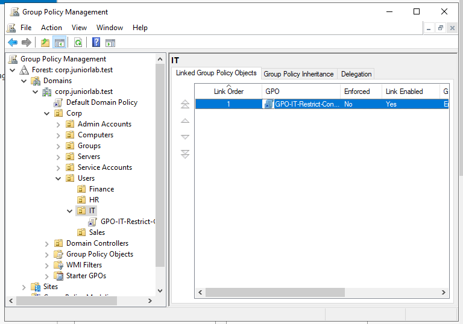
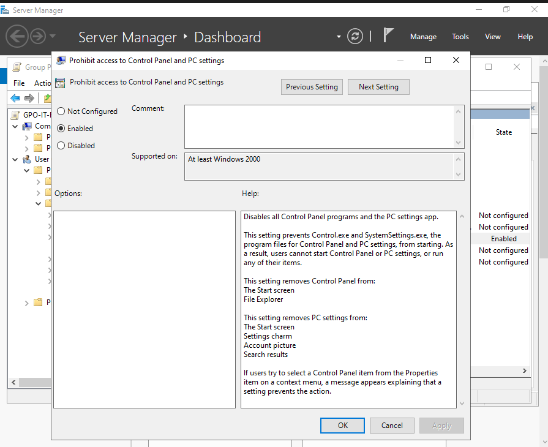
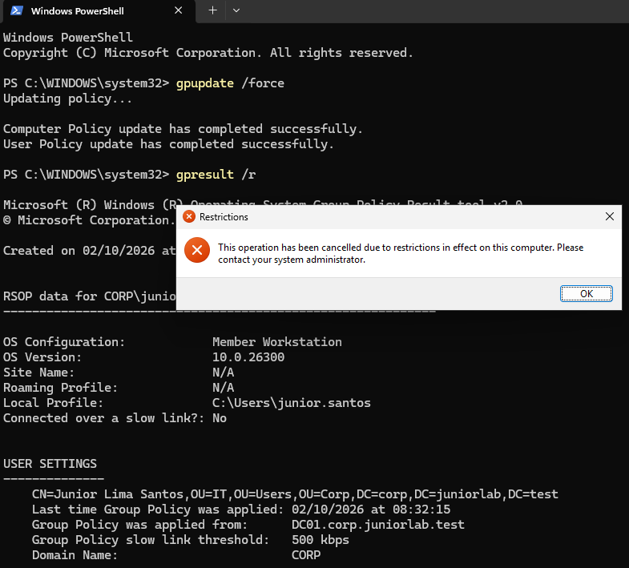

# Group Policy Deployment

## Overview

This document describes the first Group Policy deployed in the lab. A
user-based policy was created to restrict access to Control Panel and Windows
Settings for users located in the IT Organizational Unit.

The objective was to demonstrate centralized configuration management: define
a rule once on DC01 and have a domain user receive it automatically on CLIENT01.

---

## Policy Design

| Property | Configuration |
|---|---|
| GPO name | GPO-IT-Restrict-ControlPanel |
| Policy type | User Configuration |
| Link target | Corp / Users / IT |
| Target user | CORP\junior.santos |
| Client used for validation | CLIENT01 |
| Expected result | Control Panel and Windows Settings blocked |

The policy was linked to the `IT` OU because the target is a user account stored
in that OU. It was not linked to the `Workstations` OU because the configured
setting is user-based rather than computer-based.

---

## GPO Creation and Link

Group Policy Management was opened on DC01 with:

```text
gpmc.msc
```

The GPO was created and linked at:

```text
Forest: corp.juniorlab.test
└── Domains
    └── corp.juniorlab.test
        └── Corp
            └── Users
                └── IT
                    └── GPO-IT-Restrict-ControlPanel
```

The link remained enabled and was not marked as enforced. This keeps the
configuration simple while the lab contains no conflicting GPOs.



---

## Policy Configuration

The following setting was enabled:

```text
User Configuration
└── Policies
    └── Administrative Templates
        └── Control Panel
            └── Prohibit access to Control Panel and PC settings
```

Setting state:

```text
Enabled
```



---

## Client-Side Update

The standard domain user `CORP\junior.santos` signed in to CLIENT01. Policy
processing was triggered immediately with:

```powershell
gpupdate /force
```

Both the computer and user policy updates completed successfully. The effective
policy result was then checked with:

```powershell
gpresult /r
```

This workflow distinguishes two different tools:

- `gpupdate` requests a policy refresh.
- `gpresult` reports which policies and security groups are effective.

---

## Functional Validation

The Control Panel was launched with:

```text
control
```

Windows blocked the operation and displayed a restrictions message. This
confirmed the complete policy flow:

```text
GPO configured on DC01
        ↓
GPO linked to the IT user OU
        ↓
CORP\junior.santos signs in to CLIENT01
        ↓
CLIENT01 retrieves the policy from DC01
        ↓
Windows blocks Control Panel and Settings
```



---

## Technical Scope

The policy applied because `junior.santos` is stored in the linked `IT` OU.
Membership in `GG_IT_Users` was validated separately, but group membership was
not used as the primary targeting mechanism for this policy.

Because the setting is under `User Configuration`, it follows the affected user
when that user signs in to domain workstations where Group Policy processing is
available. A computer-based setting would instead be linked to an OU containing
computer objects, such as `Corp/Computers/Workstations`.

CLIENT01 and DC01 communicate directly over `LAB-LAN` for domain authentication
and policy processing. FW01 remains the gateway for traffic leaving the local
subnet but does not route traffic between hosts on the same subnet.

---

## Lessons Learned

- Creating a GPO and linking a GPO are separate concepts.
- OU placement determines the administrative scope of a linked policy.
- User Configuration and Computer Configuration target different object types.
- Group membership and OU placement serve different management purposes.
- `gpupdate /force` is useful for immediate testing, while policies also
  refresh automatically.
- A visible functional test should be combined with `gpresult` evidence.

---

## Next Steps

- Add workstation security baseline policies.
- Configure a shared corporate wallpaper using a network path.
- Deploy a file server and map department drives through Group Policy
  Preferences.
- Test policy scope with users from IT, HR, Finance and Sales.
