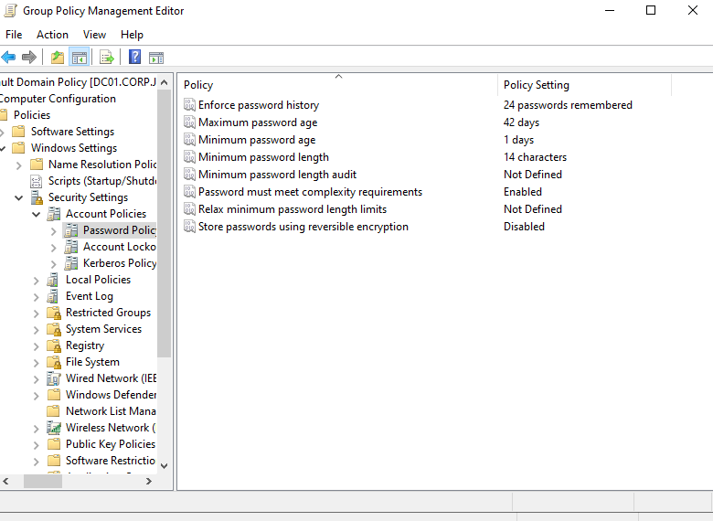
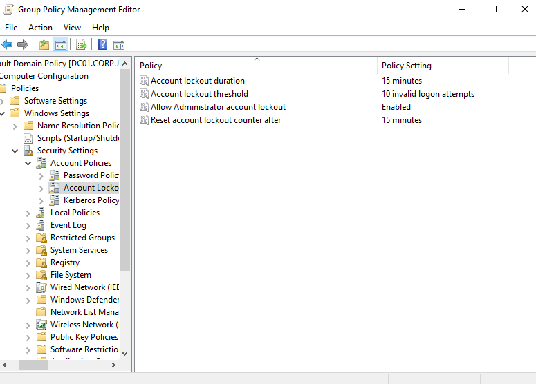
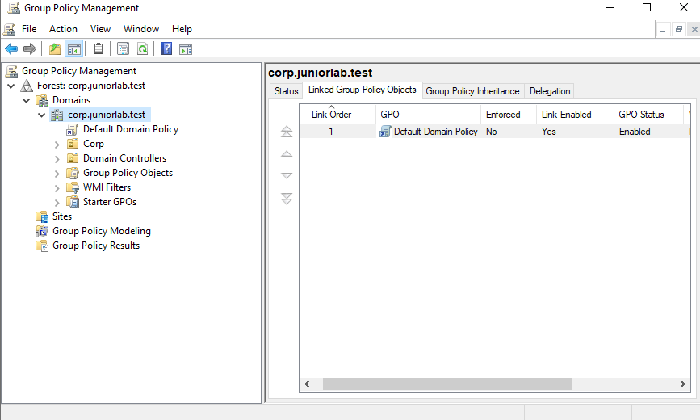
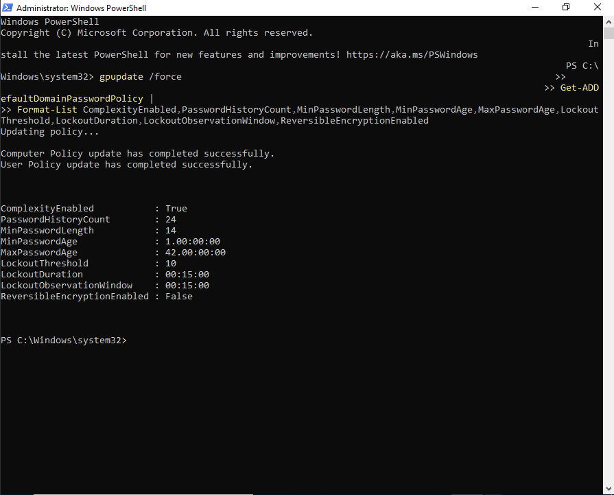
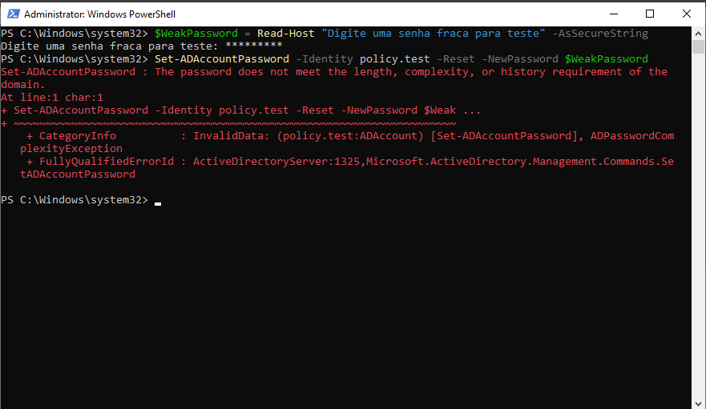
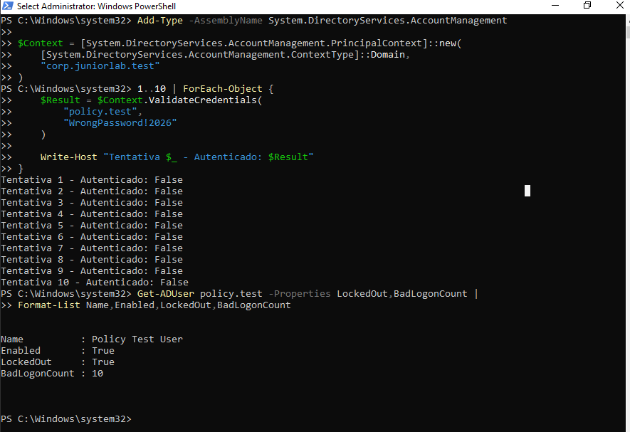
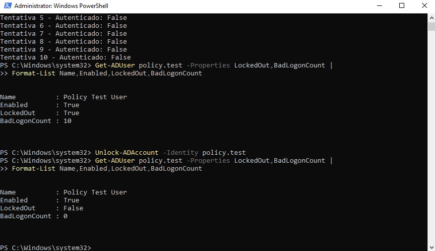

# Domain Password and Account Lockout Policy

## Overview

This document describes the implementation and validation of the domain-wide
password and account lockout policy for `corp.juniorlab.test`.

The objective was to strengthen account security, verify that weak passwords
are rejected, confirm that repeated authentication failures trigger a lockout,
and practice the administrative account-unlock workflow used by support teams.

---

## Environment

| Component | Configuration |
|---|---|
| Domain | corp.juniorlab.test |
| Domain controller | DC01 |
| Operating system | Windows Server 2022 |
| Policy location | Default Domain Policy |
| Validation tool | Active Directory PowerShell module |
| Test account | `CORP\policy.test` |

The test account was a standard, non-administrative account created only for
validation. It was disabled after the tests were completed.

---

## Recovery Checkpoint

Before changing the domain account policy, a VirtualBox snapshot was created:

```text
06-Before-Domain-Account-Security-GPO
```

This provided a recovery point before modifying a domain-wide security
configuration. A snapshot is useful for lab recovery, but it is not a
replacement for a proper backup.

---

## Password Policy

The password settings were configured at:

```text
Default Domain Policy
└── Computer Configuration
    └── Policies
        └── Windows Settings
            └── Security Settings
                └── Account Policies
                    └── Password Policy
```

| Setting | Value |
|---|---:|
| Enforce password history | 24 passwords remembered |
| Maximum password age | 42 days |
| Minimum password age | 1 day |
| Minimum password length | 14 characters |
| Password complexity | Enabled |
| Reversible encryption | Disabled |



The minimum age prevents users from rapidly cycling through passwords to
bypass the password history. Reversible encryption was disabled because it
provides substantially weaker password protection.

---

## Account Lockout Policy

The lockout settings were configured at:

```text
Default Domain Policy
└── Computer Configuration
    └── Policies
        └── Windows Settings
            └── Security Settings
                └── Account Policies
                    └── Account Lockout Policy
```

| Setting | Value |
|---|---:|
| Account lockout threshold | 10 invalid attempts |
| Account lockout duration | 15 minutes |
| Reset account lockout counter after | 15 minutes |
| Allow Administrator account lockout | Enabled |



The threshold limits repeated password-guessing attempts while the timed
lockout allows normal access to recover automatically. Administrative unlock
remains available when support intervention is required.

---

## Policy Scope

Only the `Default Domain Policy` remained linked at the domain root for the
domain account settings. This avoids maintaining duplicate domain password and
lockout configurations in separate GPOs.



The settings were refreshed with:

```powershell
gpupdate /force
```

---

## Effective Policy Validation

The policy stored by Active Directory was queried directly instead of relying
only on the values visible in the Group Policy editor:

```powershell
Get-ADDefaultDomainPasswordPolicy |
Format-List ComplexityEnabled,PasswordHistoryCount,MinPasswordLength,
MinPasswordAge,MaxPasswordAge,LockoutThreshold,LockoutDuration,
LockoutObservationWindow,ReversibleEncryptionEnabled
```

The effective result confirmed:

```text
ComplexityEnabled            : True
PasswordHistoryCount         : 24
MinPasswordLength            : 14
MinPasswordAge               : 1 day
MaxPasswordAge               : 42 days
LockoutThreshold             : 10
LockoutDuration              : 15 minutes
LockoutObservationWindow     : 15 minutes
ReversibleEncryptionEnabled  : False
```



This distinction is important: the editor shows the intended configuration,
while the directory query confirms the policy that is actually effective for
the domain.

---

## Weak Password Test

A deliberately weak password was submitted to the test account through a
secure PowerShell prompt:

```powershell
$WeakPassword = Read-Host "Enter a weak password for testing" -AsSecureString
Set-ADAccountPassword -Identity policy.test -Reset -NewPassword $WeakPassword
```

Active Directory rejected the operation because the password did not meet the
configured length, complexity, or history requirements.



The rejection demonstrated that the configured password policy was enforced,
not merely displayed in Group Policy Management.

---

## Account Lockout Test

Ten invalid authentication attempts were generated against the disposable
account. The password string used in this test was intentionally incorrect and
was not a real credential.

The account state was then checked with:

```powershell
Get-ADUser policy.test -Properties LockedOut,BadLogonCount |
Format-List Name,Enabled,LockedOut,BadLogonCount
```

The result showed:

```text
Enabled       : True
LockedOut     : True
BadLogonCount : 10
```



This confirmed that the configured threshold was enforced by the domain
controller.

---

## Administrative Unlock

The account was manually unlocked to reproduce a common help desk task:

```powershell
Unlock-ADAccount -Identity policy.test
```

The account state was queried again and returned:

```text
LockedOut     : False
BadLogonCount : 0
```



After validation, the disposable account was disabled so that an unnecessary
test identity would not remain active:

```powershell
Disable-ADAccount -Identity policy.test
```

---

## Troubleshooting and Design Correction

The settings were initially placed in a separate GPO linked to the domain.
Group Policy processing reported that the GPO was applied, but
`Get-ADDefaultDomainPasswordPolicy` showed that the intended domain password
and lockout values were not effective.

The configuration was corrected by:

1. Applying the domain account settings to `Default Domain Policy`.
2. Refreshing Group Policy on DC01.
3. Querying the effective domain policy again.
4. Removing the duplicate custom GPO.
5. Repeating the validation after cleanup.

This troubleshooting step demonstrated why an applied-GPO result alone is not
enough. Administrative changes should be verified through the service that
consumes them and, when possible, through a functional test.

---

## Security Considerations

- No production or personal password was stored in the repository.
- Password input used `Read-Host -AsSecureString` where applicable.
- The lockout test targeted a disposable, non-administrative account.
- The test account was disabled after validation.
- The administrative account was not used for intentional lockout testing.
- The duplicate GPO was removed to avoid conflicting account-policy sources.

---

## Lessons Learned

- Domain password settings should be validated through Active Directory, not
  only through the Group Policy editor.
- `gpupdate` refreshes policy processing, while
  `Get-ADDefaultDomainPasswordPolicy` reports the effective domain account
  policy.
- A controlled weak-password test provides functional evidence of enforcement.
- `BadLogonCount` and `LockedOut` help diagnose failed authentication and
  lockout incidents.
- `Unlock-ADAccount` reproduces a frequent identity-support operation.
- Test identities should be non-privileged and disabled when no longer needed.

---

## Next Steps

- Review failed-logon and lockout events in Windows Event Viewer.
- Document event IDs related to failed authentication and account lockout.
- Evaluate Fine-Grained Password Policies for groups that require different
  password rules.
- Continue with workstation and domain security baseline policies.
