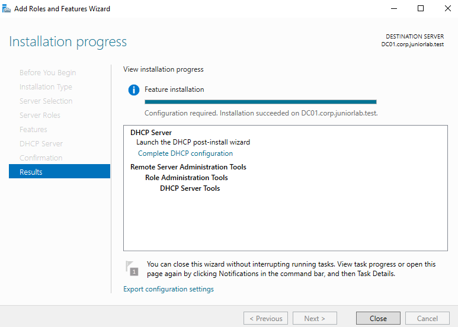
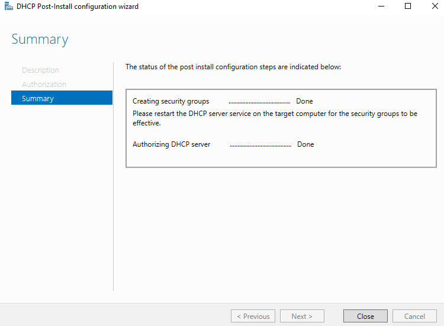
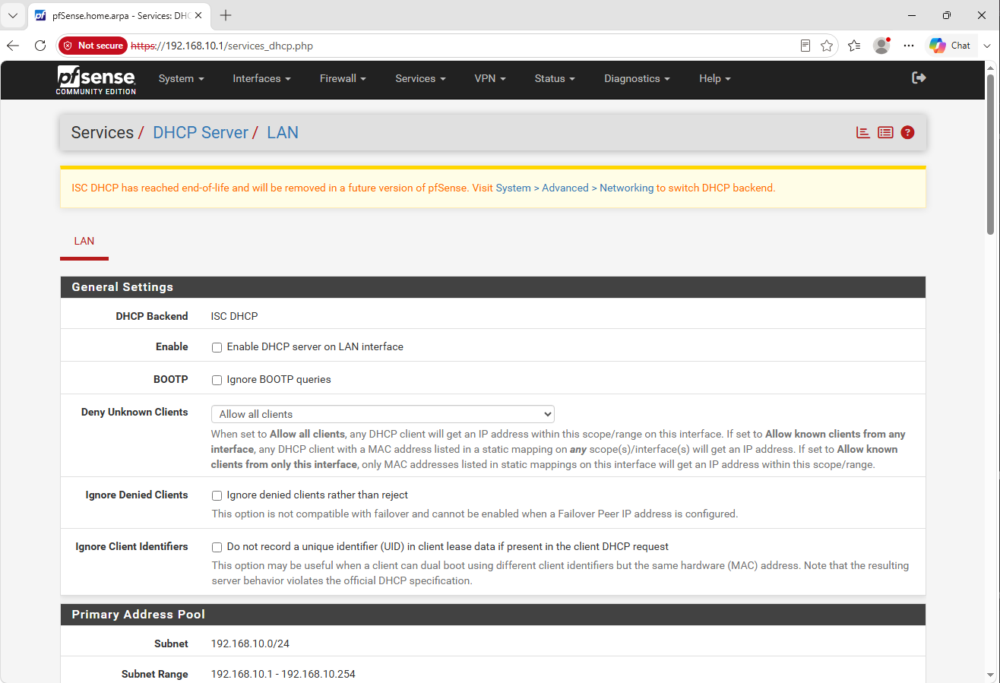
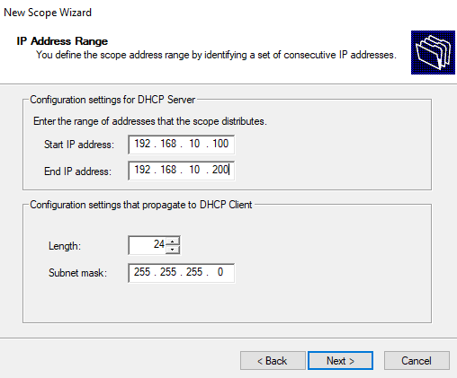
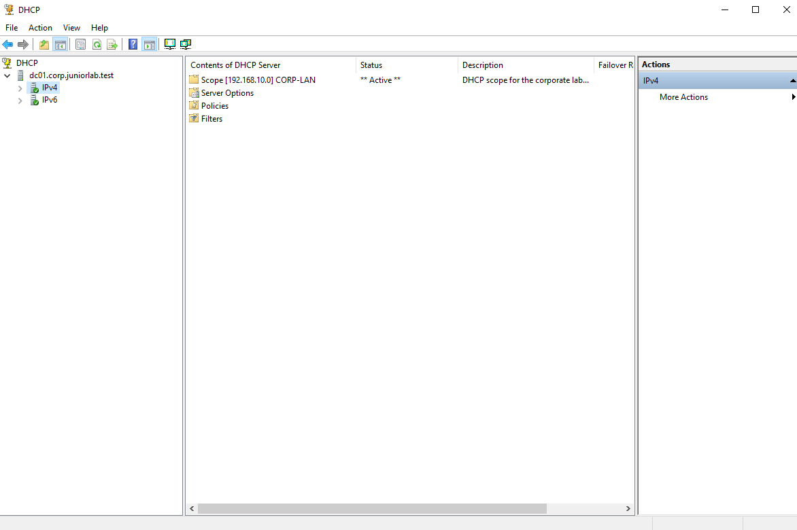
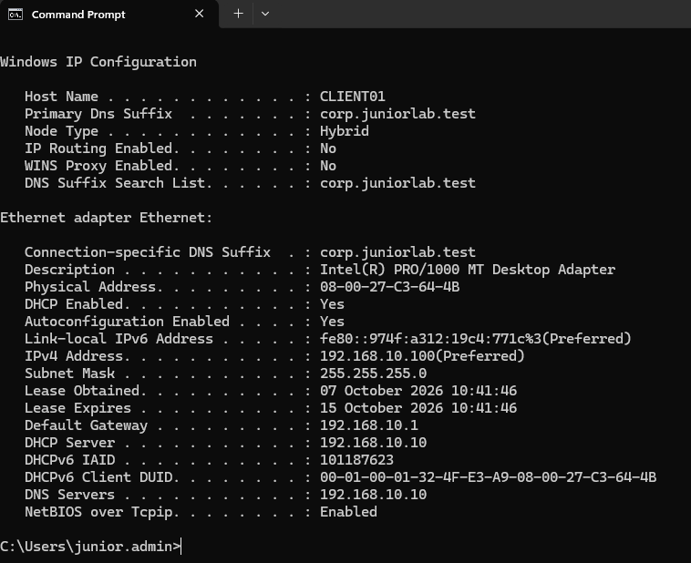
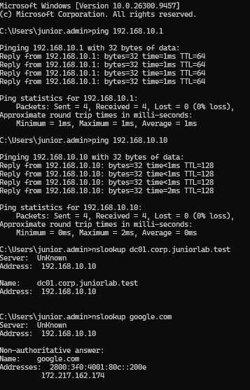
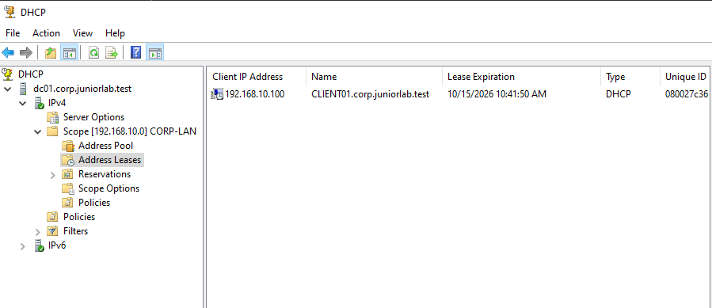

# Windows DHCP Server Deployment and Validation

## Overview

This document describes the deployment of the Windows DHCP Server role on
DC01 and the migration of dynamic IPv4 address assignment from pfSense to
Windows Server 2022.

The objective was to centralize DHCP with the existing Active Directory and
DNS services, distribute the correct network settings to domain clients and
validate the complete lease process from both the server and client sides.

---

## Environment

| Component | Configuration |
|---|---|
| Domain | `corp.juniorlab.test` |
| DHCP server | DC01 |
| DHCP server address | `192.168.10.10` (static) |
| Firewall and gateway | FW01 (pfSense), `192.168.10.1` |
| Client | CLIENT01 |
| Network | `192.168.10.0/24` |
| VirtualBox network | `LAB-LAN` |

DC01 remains statically addressed because Active Directory, DNS and DHCP
clients must be able to locate the server at a predictable address.

---

## DHCP Role Installation and Authorization

The DHCP Server role and its management tools were installed on DC01 through
Server Manager.



Because DC01 is a domain controller, the DHCP server was authorized in Active
Directory using the separate privileged account `CORP\junior.admin`. Windows
also created the DHCP security groups during the post-installation process.



Authorization and service status were verified with PowerShell:

```powershell
Get-DhcpServerInDC
Get-Service DHCPServer, DNS
```

The authorized server was returned as `dc01.corp.juniorlab.test` at
`192.168.10.10`, and both the DHCP Server and DNS Server services were running.

---

## Preventing Competing DHCP Servers

The DHCP service on the pfSense LAN interface was disabled before activating
the Windows scope.



Only one DHCP server should answer clients on this broadcast domain. Leaving
both services active could distribute conflicting gateways, DNS servers or
lease ranges. pfSense continues to provide routing, NAT and firewall services,
while DC01 now provides DHCP and internal DNS.

---

## CORP-LAN Scope Configuration

The IPv4 scope was created with the following settings:

| Setting | Value |
|---|---|
| Scope name | `CORP-LAN` |
| Network | `192.168.10.0/24` |
| Address range | `192.168.10.100` - `192.168.10.200` |
| Subnet mask | `255.255.255.0` |
| Exclusions | None |
| Lease duration | 8 days |
| Option 003 - Router | `192.168.10.1` |
| Option 006 - DNS Servers | `192.168.10.10` |
| Option 015 - DNS Domain Name | `corp.juniorlab.test` |
| WINS | Not configured |

The dynamic pool starts at `.100`, keeping lower addresses available for
infrastructure systems that require static addressing.



After its options were configured, the scope was activated in the DHCP
management console.



---

## Client Migration and Lease Validation

CLIENT01 was changed from its previous static configuration to obtain both its
IPv4 address and DNS server automatically. The existing lease was then
released and renewed:

```cmd
ipconfig /release
ipconfig /renew
ipconfig /all
```

The client received the first address in the scope and all expected DHCP
options:

| Client setting | Assigned value |
|---|---|
| Hostname | `CLIENT01` |
| DHCP enabled | Yes |
| IPv4 address | `192.168.10.100` |
| Subnet mask | `255.255.255.0` |
| Default gateway | `192.168.10.1` |
| DHCP server | `192.168.10.10` |
| DNS server | `192.168.10.10` |
| DNS suffix | `corp.juniorlab.test` |



---

## Connectivity and DNS Tests

The following tests were performed from CLIENT01:

```cmd
ping 192.168.10.1
ping 192.168.10.10
nslookup dc01.corp.juniorlab.test
nslookup google.com
```

Results:

- The pfSense gateway responded with zero packet loss.
- DC01 responded with zero packet loss.
- Internal DNS resolved `dc01.corp.juniorlab.test` to `192.168.10.10`.
- External DNS resolution succeeded through the DNS service on DC01.



The DHCP console also recorded the active lease for
`CLIENT01.corp.juniorlab.test` at `192.168.10.100`, confirming the assignment
from the server side.



---

## Troubleshooting: DC01 Received an APIPA Address

During client migration, the network adapter on DC01 was accidentally changed
to obtain an address automatically instead of changing CLIENT01. DC01 then
lost its static configuration and assigned itself an APIPA address in the
`169.254.0.0/16` range, with no default gateway.

The hostname shown by `ipconfig /all` identified that the command was being
run on DC01. The server was immediately restored to:

| Setting | Restored value |
|---|---|
| IPv4 address | `192.168.10.10` |
| Subnet mask | `255.255.255.0` |
| Default gateway | `192.168.10.1` |
| Preferred DNS | `192.168.10.10` |

The DNS and DHCP Server services were restarted and confirmed as running
before client testing continued. No snapshot rollback was required.

When the network configuration was changed on CLIENT01, the standard
`CORP\junior.santos` session was blocked from opening the adapter settings by
the existing Control Panel restriction GPO. The change was therefore performed
with the separate `CORP\junior.admin` account. This preserved the intended
separation between daily and privileged identities.

This incident reinforced two operational checks:

- Confirm the hostname before changing a remote system's network settings.
- Keep domain controllers and core network services on documented static
  addresses.

It also demonstrated the difference between `DHCP Enabled: No`, which confirms
a static IPv4 configuration, and `Autoconfiguration Enabled: Yes`, which does
not by itself mean that the adapter is using DHCP.

---

## Operational Result

The final service allocation is:

| System | Responsibility |
|---|---|
| FW01 (pfSense) | Gateway, firewall and NAT |
| DC01 | Active Directory, DNS and DHCP |
| CLIENT01 | Domain workstation and DHCP client |

Snapshots were created before and after the change so the environment can be
restored to a known-good state:

| Virtual machine | Snapshot |
|---|---|
| DC01 | `07-Before-DHCP-Installation` |
| DC01 | `08-Post-DHCP-Server-Configuration` |
| CLIENT01 | `04-Post-DHCP-Client-Validation` |
| FW01 | `03-Post-Windows-DHCP-Migration` |

---

## Lessons Learned

- A Windows DHCP server in a domain must be authorized in Active Directory.
- Competing DHCP servers on the same subnet can distribute inconsistent
  network settings.
- DHCP scope options centrally provide the gateway, DNS server and DNS suffix.
- A successful client lease should be verified from both the client and the
  server console.
- An APIPA address usually indicates that the host could not obtain a DHCP
  lease and has no valid static address.
- Infrastructure servers should retain documented static IP configurations.
- Connectivity tests and DNS tests validate different parts of the network
  path and should both be performed.

---

## Next Steps

- Deploy a Windows file server structure with SMB shares.
- Assign NTFS and share permissions through Active Directory security groups.
- Consider DHCP reservations for devices that require predictable addresses.
- Add a reverse lookup zone and PTR records to improve reverse DNS results.
